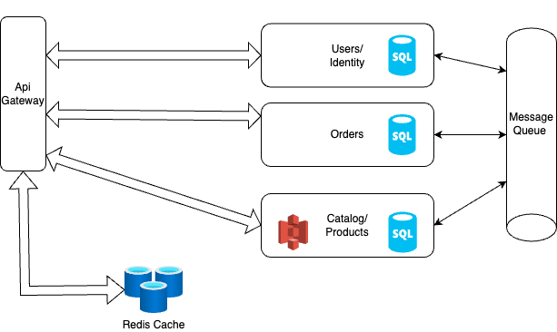

# Systems Design and Architecture

### Databases 

1. For User and Order service the data will be structured and Acid compliance is required so sql/relational DB would be way to go.
2. For Product/Catalog it would depend on the Data S3 or similar alternatives  for images
   1. if data is unstructured Nosql would be good option for example eBay orders.
   2. if data is like structured for example Automobile marketplace or parts of Computer or laptop, better to use Sql.

## Scaling 

* ~~Scaling~~ Horizontal Scaling: making use of kubernetes with auto-scaling based on load or demand.
* Kubernetes can be used it provides most of the solutions out of the Box example internal Automatic load Balancing, or plugin in any thrid party load balancer.
* Kubernetes DNS automatically provides service names and discovery mechanisms. and the Self-Healing of pods and  also for the  rolling updates.

# CI/CD 

* Source Code Management (SCM): Use GitHub/GitLab as the central repository for source code versioning. Each microservice has its own repository. 
* Continuous Integration (CI): Steps in the CI using GitHub Actions, GitLab CI, or Jenkins:
   * Docker: Containerization of each microservice.
   * Testing: Automated unit, integration, and lint checks. using GitHub actions or jenkins
* Code Push/PR: Developers push code to the repository or create pull request (PR). This triggers the CI pipeline.
   * Unit Tests: Run unit tests to validate the business logic of each service.
   * Integration Tests: Run integration tests to verify service communication, DB interaction, etc.
   Docker Image Build:
   * Build a Docker image.
   * Tag the image with a unique version ( Git commit hash, branch name).
   Push to Docker Registry:
   * After successful tests, push the Docker images to a container registry  any Public or private hosted service.

* Continuous Deployment (CD): depending on the requirements using managed Kubernetes offerings like EKS/GKE/AKS from the cloud providers would a good option
* Though I do not have actual experience with CD but if required and read about it and can easily manage. 
   * After Docker images are pushed to the registry, a new deployment pipeline shal be  triggered.
   * maybe making use of Helm charts for each microservice to manage Kubernetes manifests (e.g., deployments, services, config maps, secrets). or  secrets manager from AWS, or azure 
   * Perform a rolling update where old Pods are gradually replaced with new ones, ensuring zero downtime.

